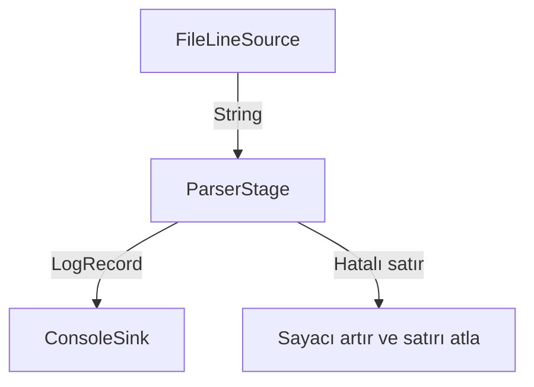

# LogFlow Mimarisi

## Bileşenlerin sorumlulukları

| Bileşen | Sorumluluk |
| --- | --- |
| Source<O> | Veri üretme sözleşmesi |
| Stage<I, O> | Bir girdiyi işleyip çıktı üretme sözleşmesi |
| Emitter<T> | Üretilen veriyi sonraki bileşene aktarma |
| Sink<I> | Son veriyi tüketme sözleşmesi |
| FileLineSource | UTF-8 dosyayı satır satır okuma |
| ParserStage | String girdiyi LogRecord nesnesine dönüştürme |
| ConsoleSink | LogRecord alanlarını konsola yazdırma |
| SummarySource | Kaynak tamamlandığında hatalı satır sayısını yazdırma |
| Pipeline | Kaynak, aşamalar ve sink bağlantısını kurma |
| Main | Argümanı alma, bileşenleri oluşturma ve çalıştırma |

## v2 veri akışı

SummarySource, FileLineSource'u sarar ve kaynak üretimi
tamamlandığında ParserStage'in hatalı satır sayısını okur.

## Pipeline bağlantısı

Pipeline.from(source) başlangıç kaynağını belirler.
then(stage), aşamayı sıralı listeye ekler ve emitter
bağlantısını kurar.
to(sink), son çıktıyı tüketecek bileşeni belirler.
run(), kaynaktan başlayarak veri akışını çalıştırır.

Generik türler sayesinde ParserStage sonrasında
Pipeline<LogRecord> elde edilir ve Sink<LogRecord>
ile bağlantı kurulur.

StageException oluşursa Pipeline bunu
IllegalStateException içine sararak iletir.

## Veri modeli

LogRecord değiştirilemez bir Java record'dur.

timestamp, clientIp, method, path, status, bytes,
userAgent, attributes ve raw alanlarını içerir.

Zaman bilgisi Instant olarak tutulur.
raw, orijinal satırın korunmasını sağlar.
attributes, gelecekteki aşamaların ek bilgileri için ayrılmıştır
ve Map.copyOf ile değiştirilemez hale getirilir.

## Hata davranışı

ParserStage hatalı girdilerde kayıt üretmez.
Hatalı satır sayısını artırır ve sonraki satırı işlemeye devam eder.

Geçerli bir satır tam olarak bir LogRecord üretir.

FileLineSource dosya okuma hatalarını UncheckedIOException
olarak iletir.

## Main'in sınırı

Main log ayrıştırmaz ve kayıt alanlarını biçimlendirmez.
Yalnızca komut satırı argümanını alır, bileşenleri
birbirine bağlar ve run() çağrısını yapar.

## Yaşam döngüsü

Stage arayüzündeki open() ve close() metotları
varsayılan olarak boş tanımlanmıştır.
Bu sürümde Pipeline tarafından çağrılmazlar.

## Test yaklaşımı

Parser testleri dosya sisteminden bağımsızdır.
Emitter olarak records::add kullanılır.
Üretilen kayıtlar ve hatalı satır sayısı doğrulanır.

JUnit 5 testleri Maven ile çalıştırılır.
JaCoCo, otomatik testlerin kapsamını raporlar.